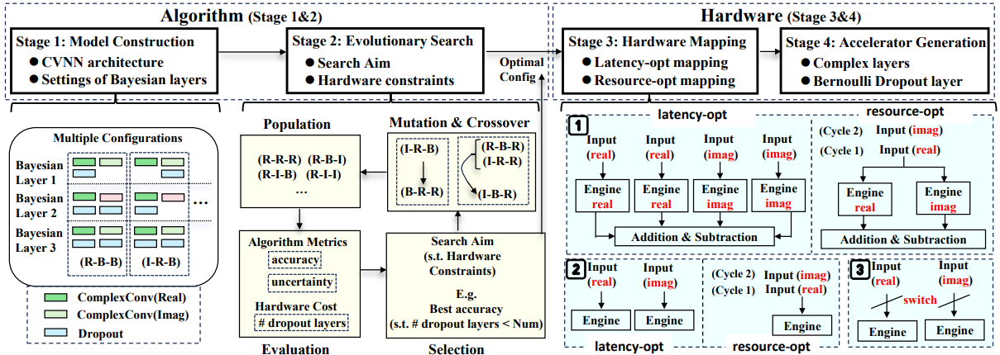
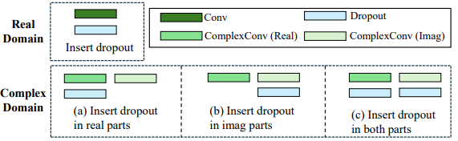

# BayesCVNN

Code of the DAC 2026 paper **Algorithm and Hardware Co-Design for Efficient Complex-Valued Uncertainty Estimation**.

BayesCVNN introduces dropout-based Bayesian Complex-Valued Neural Networks for uncertainty estimation in complex-valued applications. The repository includes software experiments for complex-valued and real-valued datasets, an automated configuration-search workflow for real/imaginary dropout placement, and an FPGA-oriented hardware generation flow.

[[Paper](https://doi.org/10.1145/3770743.3804197)] [[arXiv](https://arxiv.org/abs/2604.19993)]



## Overview

Complex-Valued Neural Networks (CVNNs) are effective for data with real and imaginary components, such as radar and SAR signals, but standard CVNNs do not directly provide predictive uncertainty. BayesCVNN extends CVNNs with dropout-based Bayesian inference and explores how Bayesian layers should be inserted across real and imaginary components.

The framework contains four stages:

1. **Model construction**: build CVNN architectures with configurable Bayesian layers.
2. **Evolutionary search**: search for real/imaginary dropout configurations under accuracy, uncertainty, and hardware constraints.
3. **Hardware mapping**: map complex-valued operations with latency-oriented or resource-oriented schemes.
4. **Accelerator generation**: generate customized FPGA accelerators for BayesCVNN models.

## Search Space

The dual-part nature of complex values creates a larger configuration space than real-valued neural networks. For each candidate Bayesian layer, dropout can be inserted into the real part, the imaginary part, or both parts.



## Repository Structure

```text
.
├── Software
│   ├── Complex-Valued
│   │   ├── Train_class7_Bayesian.py
│   │   ├── Predict_class7_Bayesian.py
│   │   └── Src
│   └── Real-Valued
│       ├── MNIST
│       │   └── BayesNN_ComplexLeNet.py
│       └── SVHN
│           └── svhn_complex.py
├── Hardeware
│   ├── autobayes
│   ├── bayes_hw
│   │   └── models
│   │       ├── CV_qmodels_ComplexLeNet.py
│   │       └── CV_hls4ml_build_ComplexLeNet.py
│   └── converter
└── assets
```

Note: the hardware directory is currently named `Hardeware/` in the repository.

## Software

The software implementation is organized into two parts:

- `Software/Complex-Valued/`: complex-valued Bayesian models for complex-valued datasets and uncertainty evaluation.
- `Software/Real-Valued/`: real-valued dataset experiments using complex-valued models, including MNIST and SVHN.

## Hardware

The hardware flow is located under `Hardeware/` and contains:

- `Hardeware/converter/`: PyTorch, Keras, and complex-valued Keras conversion utilities.
- `Hardeware/autobayes/`: scripts for conversion-time and synthesis-report experiments.
- `Hardeware/bayes_hw/models/`: QKeras and hls4ml model-generation scripts for ComplexLeNet-style BayesCVNN accelerators.

The accelerator flow targets FPGA implementation through quantized model construction and HLS generation. The code includes latency-oriented and resource-oriented build variants for complex-valued layers and Bayesian dropout configurations.

## Dependencies

The software and hardware parts use separate stacks. The main dependencies include:

- Python
- PyTorch
- complexPyTorch
- TensorFlow / Keras
- QKeras
- hls4ml
- Vivado-HLS

Hardware-specific scripts require a configured FPGA/HLS environment.

## Citation

If you find this repository useful in your research, please cite:

```bibtex
@inproceedings{zhang2026algorithm,
  title={Algorithm and Hardware Co-Design for Efficient Complex-Valued Uncertainty Estimation},
  author={Zhang, Zehuan and Chen, Mark and Li, He and Luk, Wayne},
  booktitle={Proceedings of the 63rd ACM/IEEE Design Automation Conference},
  year={2026}
}
```

